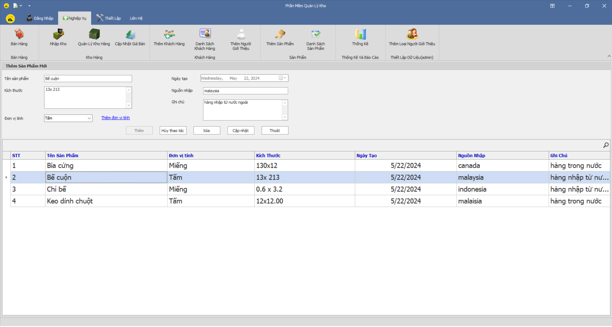

# Phần mềm quản lý kho hàng

## Mục lục
* [Giới thiệu](#giới-thiệu)
* [Các chức năng chính](#Các-chức-năng-chính)
* [Yêu cầu để thực thi dự án](#yêu-cầu-để-thực-thi-dự-án)
* [Cài đặt](#cài-đặt)
* [Cách sử dụng](#cách-sử-dụng)
* [Giao diện](#giao-diện)
* [Tình trạng dự án](#tình-trạng-dự-án)
* [Liên hệ](#liên-hệ)

## Giới thiệu
* Đây là phần mềm quản lý kho hành cho các nhà kho vừa và nhỏ. Phần mềm đáp ứng đầy đủ nhu cầu của khách hàng.
* Ứng dụng được xây dựng theo mô hình 3 lớp, cài đặt giao diện bằng C# Winforms, sử dụng công cụ DevExpress để phát triển giao diện.
* Cơ sở dữ liệu bao gồm 1 procedures, 4 trigger, 1 function
* Database Diagram:

  
# Các Chức Năng Chính
- Quản Lý Bán Hàng
- Quản Lý Kho Hàng
- Quản Lý Nhân Viên
- Quản Lý Nhập Xuất Hàng
- Quản Lý Khách Hàng
- Thống kê sản phẩm
- Thống kê công nợ và hóa đơn bán hàng
- Báo cáo Nhập kho
- Lập Hóa Đơn Bán Hàng
  
## Yêu cầu để thực thi dự án
- Phần mềm chạy trên hệ điều hành Windows các phiên bản từ XP -> Windows 10
- Hệ điều hành có cài .NET Framework phiên bản 4.0 trở lên
- Hệ điều hành có cài đặt SQL SERVER
- Hệ điều hành có cài đặt công cụ DevExpress
  
## Cài đặt
1. Cài đặt Visual Studio 2019 và .Net Framework 
2. Cài đặt SQL Sever 2019 Express và SSMS
3. Thực thi file data.sql để khởi tạo database

## Cách sử dụng
Mở file "./PM_QuanLyKhoHang/PM_QuanLyKhoHang.sln" bằng Visual Studio 2019

## Giao diện
Đăng nhập

Bán hàng:

Nhập kho:

Thêm sản phẩm:

Thống kê và Báo cáo:

## Tình trạng dự án
Đã hoàn thành

## Liên hệ
[Minh Triều](https://github.com/mt276)
